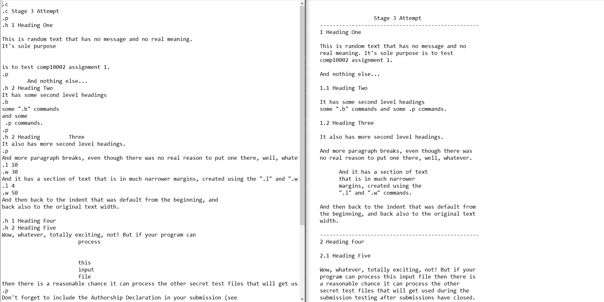

# Projects-in-C

this repository contains programs I wrote purely in C, without the use of external libraries

# Bridge Repair

I wrote this program for the Design of Algorithms subject in Semester 2 of first year. It takes an input containing a 2x2 grid of variable dimensions that proposes a route from start to finish, along with a number of blockages along the route. The program I wrote processes this information and evaluates the proposed route to see if it is valid or blocked. If it's blocked, then it will dynamically repair the route by re-routing around the blocks, taking the shortest route possible to the destination.

**how to use**: navigate to source directory and run "gcc -o app bridgerepair.c", then run the program, feeding in any of the test inputs: "app < test0.txt"

# Text Formatter

I wrote this program for the Design of Algorithms subject in Semester 1 of first year. It takes an unformatted text file that contains a specific set of formatting commands, and generates the corresponding output file which has the text neatly formatted as per the formatting instructions. An example of a command would be ".p", which asks for a paragraph to be inserted.

**example** - here is a snapshot of what this program can achieve:

  

**how to use**: navigate to source directory and run "gcc -o app TextFormatter.c", then run the program, feeding in any of the input files and creating an output: "app < stage1.txt > out.txt"
